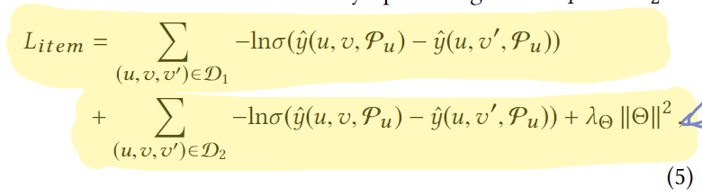

* 摘要

  * 采用对话技术动态获取用户偏好，克服静态模型的历史局限性。
  * CRS需要解决的三个基本问题
    * 每轮对话需要问用户什么属性？(感觉与决策数构建选属性的目的一致)
    * 什么时候推荐物品？(询问次数越多肯定越精确，但是不现实)
    * 如何去适应用户的在线反馈？(怎么处理用户的交互信息)
  * EAR(Estimation–Action–Reflection)框架的三个阶段
    * Estimation：构建预测模型预测用户对物品(物品属性)的偏好。
    * Action：学习一种对话的策略(类似于自动机？)来每次根据用户的交互历史和Estimation模型的判断是继续询问还是结束询问推荐物品。
    * Reflection：当用户拒绝系统在Actioin阶段提出的建议时更新推荐模型。

* 介绍

  * 一般的推荐系统只能使用离线的数据来建立模型，但是用户的喜好是多样的，而且会随时间变化。因此即使有足够多的历史数据也无法建立完美的模型。
  * 很多CRS模型都只处理一轮交互(感觉不能算对话)。
  * 在每轮交互中，CRS可以选择继续询问属性或者给出一个推荐列表，CRS的目的是尽量用较少的交互次数来精确的推荐。
  * 对话组件和推荐组件交互的三个基本问题：
    * 问什么属性
    * 什么时候推荐
      * 候选集足够小
      * 在问额外的问题意义不大(感觉就像性价比最高的点)
      * 推荐系统有很大把握推荐的物品会被接收(比如概率大于0.9？)
    * 怎么处理用户的反馈
  * 三个阶段做的事情&交互：

  

* 方法

  ​	开始的时候由RC部分计算出用户的候选属性和候选物品去支持CC的决策，在Estimation部分结束后，到action部分CC通过RC计算出的候选集和对话历史来绝对是继续询问属性或者推荐物品。如果用户喜欢当前问询的属性，则反馈给RC继续Estimation阶段或者可以继续询问其它属性。当用户不喜欢当前推荐的属性的时候，CC反馈给RC，出发reflection部分来调整，然后进入Estimation阶段继续推荐排序。

  * Estimation：该部分需要充分利用交互过的用户喜欢的属性集$p _{u}$。

    * 基本的推荐方法：其中$u^Tv$代表用户对目标物品的喜欢程度，$v^Tp_{i}$代表物品和用户喜欢的属性之间的关联。

    

    ​	传统的BPR_loss如下：

    

    * 然而CRS要重点考虑用户喜欢的属性，因此增加一个新的负样本定义如下：

    

    ​		BPR_loss变为如下：

    ​	

  * Action：该部分关注对话策略而不是理解语义。

    * 状态向量：由$S = S_{ent}+S_{his}+S_{pre}+S_{len}$。

      * $S_{ent}$表示候选集物品中每个属性的熵，选择熵大的有利于更新候选集，可以在更少的轮次进行推荐。
      * $S_{his}$表示用户的交互历史，-1表示失败，0表示不喜欢询问的属性，1代表询问的属性用户喜欢。
      * $S_{pre}$表示用户在每个属性的偏好，是Estimation中计算最佳询问属性时计算的结果。
      * $S_{len}$表示候选集的大小，限制在足够小的时候进行推荐。

    * 策略网络：决策空间为$size|P|+1$

      * $r_{suc}$：强正向奖励，表示推荐成功。
      * $r_{ask}$：弱正向奖励，表示属性推荐成功。
      * $r_{quit}$：强负向奖励，表示用户退出。
      * $r_{prev}$：每轮都给一个弱的负向奖励，避免轮数过长。

      反向传播如下：

      

      $R_{t}$计算如下：

      

      表示轮数越长，奖励越小。

  * Reflection：当推荐的物品用户不接受时触发，在线更新（怎么做？需要看代码实现），采用批量梯度下降，loss同样采用BPR_loss。

* 实验

  实验验证四个问题：1.CRS与其它对话推荐系统相比性能如何？2.在BPR中关注属性与物品的联系与多任务训练对RC有何影响？3.Ation中为设置的状态向量合理吗？4.在线更新对推荐有更好的帮助吗？

  * Setting
    * 去除评论少于10个的用户减少数据稀疏性。
    * 7：2：1的训练测试验证划分。
    * XXXX
  * User Simulator
    * 使用历史的用户交互数据作为groud-truth，物品的属性作为用户的选择。
    * 设置最大交互轮数为15。
    * 推荐列表设为10。